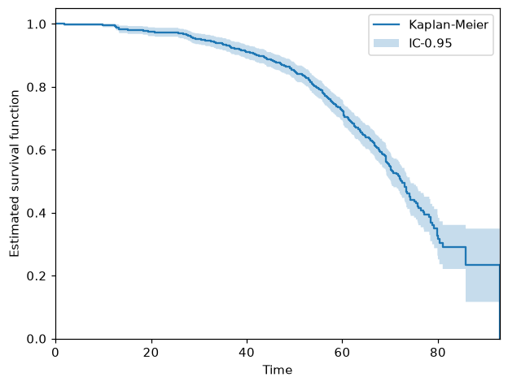
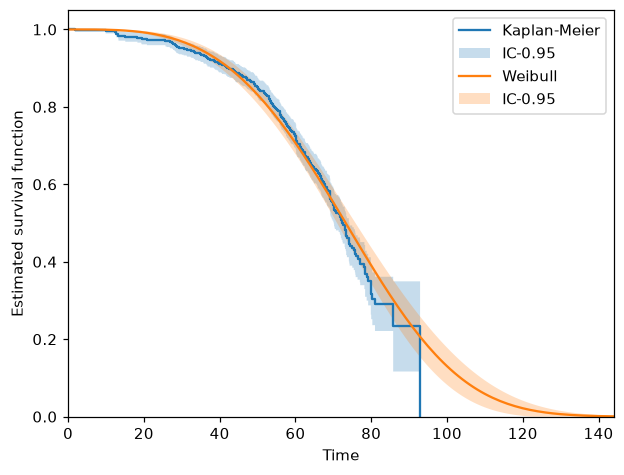
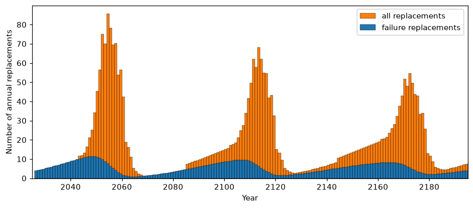

# Getting Started


> ReLife's workflow: from data collection to the consequences of a maintenance policy

ReLife's workflow has four steps, left to right in the figure above:

1. You **collect failure data** on a fleet of assets.
2. You **fit a lifetime model** to that data.
3. You **build a maintenance policy** (run-to-failure, or preventive age replacement) and
   optimize it against costs.
4. You **project the consequences** of that policy (for instance the expected number of
   replacements per year).

This page walks the four steps on a built-in dataset. See the [user guides](user_guides/index.md)
for the concepts behind each one.

## 1. Data collection

ReLife ships example datasets so you can get started without your own data (see
[Datasets](user_guides/datasets.md)). Here we use the *power transformer* dataset. If you're not
familiar with the asset, see [the Wikipedia page](https://en.wikipedia.org/wiki/Transformer).

```python
>>> from relife.datasets import load_power_transformer
>>> dataset = load_power_transformer()
>>> dataset.dtype.names
('time', 'event', 'entry')

```

`dataset` is a [structured array](https://numpy.org/doc/stable/user/basics.rec.html) with
three fields:

- `time`: the observed lifetime values.
- `event`: whether the failure actually happened inside the observation window
  (`False` means the lifetime is *right-censored*, i.e. the asset was still alive when we
  stopped looking).
- `entry`: the age of the asset when the observation window opened (*left-truncation*).

```python
>>> dataset["time"][:3]
array([34.3, 45.1, 53.2])
>>> dataset["event"][:3]
array([ True,  True,  True])
>>> dataset["entry"][:3]
array([34., 44., 52.])

```

Censoring and truncation are not details to be cleaned away. They carry information, and
every ReLife estimator accounts for them. See
[Censoring and truncation](user_guides/background/lifetime_modeling/censoring_and_truncation.md).

## 2. Lifetime model estimation

It's a good idea to start with a **non-parametric** model, which assumes no particular shape.
The Kaplan-Meier estimator is a step function that drops at each observed failure and stays
flat in between, so it follows the data without imposing any parameters on it:

```python
>>> from relife.lifetime_models import KaplanMeier
>>> km = KaplanMeier(
...     dataset["time"], event=dataset["event"], entry=dataset["entry"]
... )

```

```python
>>> import matplotlib.pyplot as plt
>>> from relife.datasets import load_power_transformer
>>> from relife.lifetime_models import KaplanMeier
>>> dataset = load_power_transformer()
>>> km = KaplanMeier(
...     dataset["time"], event=dataset["event"], entry=dataset["entry"]
... )
>>> _ = km.plot("sf", label="Kaplan-Meier")
>>> _ = plt.xlabel("Time")
>>> _ = plt.ylabel("Estimated survival function")
>>> _ = plt.legend()
>>> plt.show()

```



Then fit a **parametric** model (here a Weibull distribution). The two fitted values are the
Weibull `shape` and `rate`. A shape above 1 means the hazard rate increases with age: the
assets wear out, which is what makes preventive replacement worth considering at all.

```python
>>> from relife.lifetime_models import Weibull
>>> weibull = Weibull().fit(
...     dataset["time"], event=dataset["event"], entry=dataset["entry"]
... )
>>> weibull.get_params()
array([3.46597396, 0.0122785 ])

```

Overlay of the two survival functions shows agreement between them and is a common sanity
check: it means the parametric shape you chose is compatible with what the data shows on its
own.

```python
>>> import numpy as np
>>> import matplotlib.pyplot as plt
>>> from relife.datasets import load_power_transformer
>>> from relife.lifetime_models import KaplanMeier, Weibull
>>> dataset = load_power_transformer()
>>> km = KaplanMeier(
...     dataset["time"], event=dataset["event"], entry=dataset["entry"]
... )
>>> weibull = Weibull().fit(
...     dataset["time"], event=dataset["event"], entry=dataset["entry"]
... )
>>> timeline = np.arange(0, 145)
>>> _ = km.plot("sf", label="Kaplan-Meier")
>>> _ = weibull.plot("sf", timeline, label="Weibull")
>>> _ = plt.xlabel("Time")
>>> _ = plt.ylabel("Estimated survival function")
>>> _ = plt.legend()
>>> plt.show()

```



## 3. Maintenance policy optimization

A lifetime model alone doesn't say *when* to replace an asset. For that you wrap it in a
policy and give it the two costs that drive the trade-off:

- `cp`, the cost of a **preventive** replacement, that you can choose;
- `cf`, the cost of an **unexpected failure**, which is (almost always, some specific cases
  exists) higher because it includes the undesirable consequences of the failure itself.

Costs must have a specific unit: euros, dollars, millions of either, or
anything else works, as long as `cp` and `cf` use the *same* unit. Whatever you put in is
what comes back out, so the annual costs below are in that same unit too.

Here `cp` = 3 and `cf` = 11, with a 4 % discounting rate. Replacing every asset
preventively at the optimal age costs less per year than waiting for failures:

```python
>>> from relife.policies import AgeReplacementPolicy, RunToFailurePolicy
>>> policy = AgeReplacementPolicy(weibull)
>>> ar_star = policy.compute_optimal_ar(cf=11., cp=3., discounting_rate=0.04)
>>> round(ar_star, 4)
np.float64(59.1975)
>>> round(policy.asymptotic_expected_equivalent_annual_cost(
...     ar=ar_star, cf=11., cp=3., discounting_rate=0.04
... ), 6)
np.float64(0.035023)

```

```python
>>> round(RunToFailurePolicy(weibull).asymptotic_expected_equivalent_annual_cost(
...     cf=11., discounting_rate=0.04
... ), 6)
np.float64(0.039082)

```

Replacing at age `ar_star` (about 59 years) is roughly 10 % cheaper per year than running
the assets to failure.
[Preventive age replacement policy](user_guides/background/maintenance_policies/preventive_age_replacement.md)
explains where these numbers come from.

## 4. Projection of consequences

Finally, project what the policy implies for a real fleet. We take 1000 assets whose current
ages are drawn from a binomial distribution, and ask for the expected number of replacements
over the next 170 years. ReLife answers by solving **the renewal equation** (see
[Renewal processes and the renewal equation](user_guides/background/maintenance_policies/renewal_theory.md)).

```python
>>> import numpy as np
>>> rng = np.random.default_rng(42)
>>> a0 = rng.binomial(60, 0.5, 1000).astype(float)  # current age of each asset
>>> timeline, replacements = policy.annual_number_of_replacements(170, ar=ar_star, a0=a0)
>>> _, failures = policy.annual_number_of_failures(170, ar=ar_star, a0=a0)
>>> timeline.shape, replacements.shape
((170,), (170, 1000))

```

You get one value per year and per asset. Summing over the fleet gives the workload to plan
for, and how much of it is unplanned failure rather than scheduled replacement:

```python
>>> round(float(replacements.sum()), 1)
3113.5
>>> round(float(failures.sum()), 1)
889.8

```

ReLife has no built-in plot for this, but the arrays go straight into
[Matplotlib](https://matplotlib.org/):

```python
>>> import numpy as np
>>> import matplotlib.pyplot as plt
>>> from relife.datasets import load_power_transformer
>>> from relife.lifetime_models import Weibull
>>> from relife.policies import AgeReplacementPolicy
>>> dataset = load_power_transformer()
>>> weibull = Weibull().fit(
...     dataset["time"], event=dataset["event"], entry=dataset["entry"]
... )
>>> policy = AgeReplacementPolicy(weibull)
>>> ar_star = policy.compute_optimal_ar(cf=11., cp=3., discounting_rate=0.04)
>>> rng = np.random.default_rng(42)
>>> a0 = rng.binomial(60, 0.5, 1000).astype(float)
>>> timeline, replacements = policy.annual_number_of_replacements(
...     170, ar=ar_star, a0=a0
... )
>>> _, failures = policy.annual_number_of_failures(170, ar=ar_star, a0=a0)
>>> fig, ax = plt.subplots(figsize=(10, 4))
>>> _ = ax.bar(
...     timeline + 2025, replacements.sum(axis=1), align="edge", width=1.,
...     label="all replacements", color="C1", edgecolor="black", linewidth=0.3,
... )
>>> _ = ax.bar(
...     timeline + 2025, failures.sum(axis=1), align="edge", width=1.,
...     label="failure replacements", color="C0", edgecolor="black", linewidth=0.3,
... )
>>> _ = ax.set_xlabel("Year")
>>> _ = ax.set_ylabel("Number of annual replacements")
>>> _ = ax.set_xlim(left=2025, right=2025 + 170)
>>> _ = ax.set_ylim(bottom=0)
>>> _ = ax.legend(loc="upper right")
>>> plt.show()

```



The replacement waves you see are the fleet's current age distribution propagating forward:
assets installed around the same time come due around the same time, and the peaks damp out
over successive cycles.

## Next steps

- [User guides](user_guides/index.md) for the concepts (censoring and truncation, lifetime
  models, maintenance policies) behind the calls above.
- [API](api/index.md) for the full reference.
