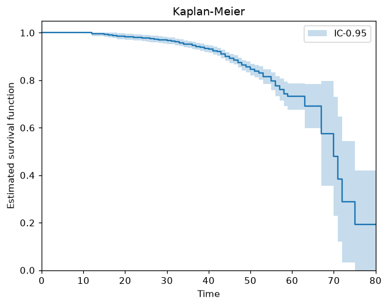
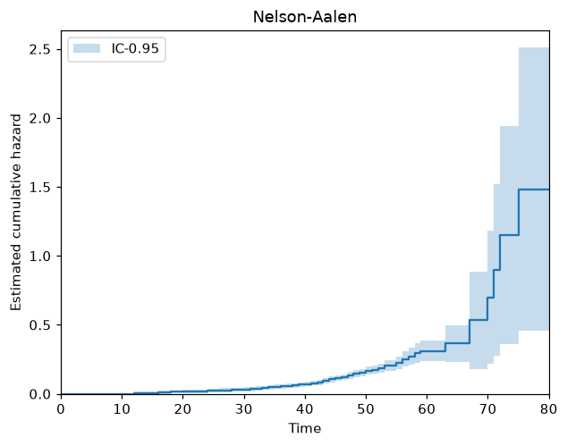
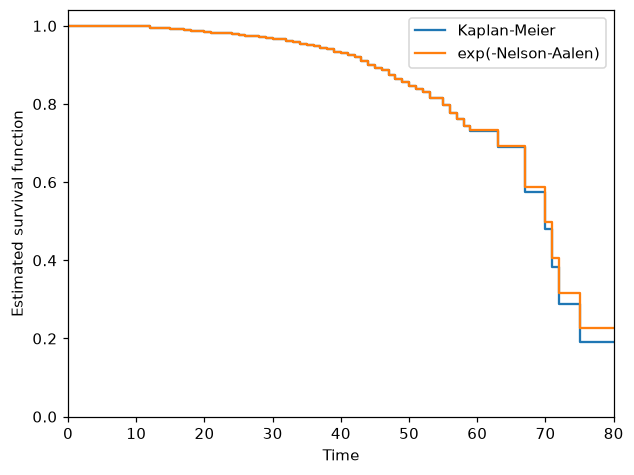

# Non-parametric lifetime models

Before fitting a parametric distribution, it's often useful to estimate the survival or
hazard function directly from the data, without assuming any particular shape. ReLife
provides two censoring-aware estimators for this, Kaplan-Meier and Nelson-Aalen. Both take
the `event` and `entry` arguments and therefore account for right censoring and left
truncation (see [Censoring and truncation](censoring_and_truncation.md)), which matters here:
on `load_circuit_breaker`, only ~5% of the 4204 units were actually observed failing.

```python
>>> from relife.datasets import load_circuit_breaker
>>> dataset = load_circuit_breaker()

```

Both estimators share the same idea. Index the units of the dataset by \(j\), so that
unit \(j\) is observed on \([\textrm{entry}_j, \textrm{time}_j]\), and write
\(t_1 < t_2 < \dots < t_n\) for the ordered distinct observed times, \(d_i\) for the
number of failures recorded at \(t_i\), and \(n_i\) for the number of units
**at risk** just prior to \(t_i\), that is the units already entered and not yet failed
or censored:

\[
    n_i = \#\{ j : \textrm{entry}_j \leq t_i \leq \textrm{time}_j \}
\]

Censoring and truncation only enter through these two counts: a censored unit contributes to
\(n_i\) up to the time it was last seen but never to \(d_i\), and a left-truncated
unit only starts contributing to \(n_i\) once it enters the observation window.

## Kaplan-Meier: survival function

The Kaplan-Meier (product-limit) estimator reads each observed failure time as a conditional
probability of surviving that instant, \(1 - d_i/n_i\), and multiplies them along the
timeline:

\[
    \hat{S}(t) = \prod_{i: t_i \leq t} \left( 1 - \frac{d_i}{n_i}\right)
\]

The estimate is a step function that drops only where a failure was actually observed and
stays flat everywhere else, so censored units never push the curve down:

```python
>>> import matplotlib.pyplot as plt
>>> from relife.datasets import load_circuit_breaker
>>> from relife.lifetime_models import KaplanMeier
>>> dataset = load_circuit_breaker()
>>> km = KaplanMeier(dataset["time"], event=dataset["event"], entry=dataset["entry"])
>>> _ = km.plot("sf")
>>> _ = plt.xlabel("Time")
>>> _ = plt.ylabel("Estimated survival function")
>>> _ = plt.title("Kaplan-Meier")
>>> plt.show()

```



The shaded band is a 95% confidence interval, derived from Greenwood's formula. It widens
along the timeline because fewer and fewer units remain at risk, so the tail of the curve
rests on very few observations.

```python
>>> from relife.lifetime_models import KaplanMeier
>>> km = KaplanMeier(dataset["time"], event=dataset["event"], entry=dataset["entry"])
>>> round(km.sf().values[-1], 6)
np.float64(0.191937)

```

Roughly 19% of the fleet is estimated to still be surviving at the end of the observed
timeline.

## Nelson-Aalen: cumulative hazard

The Nelson-Aalen estimator targets the cumulative hazard function \(H(t)\) instead of
the survival function, using the same at-risk logic. Where Kaplan-Meier multiplies survival
probabilities, Nelson-Aalen accumulates failure rates:

\[
    \hat{H}(t) = \sum_{i: t_i \leq t} \frac{d_i}{n_i}
\]

Being a sum of non-negative increments, the estimate increases with time. Its slope is the
hazard rate: a steepening curve means the units are wearing out.

```python
>>> import matplotlib.pyplot as plt
>>> from relife.datasets import load_circuit_breaker
>>> from relife.lifetime_models import NelsonAalen
>>> dataset = load_circuit_breaker()
>>> na = NelsonAalen(dataset["time"], event=dataset["event"], entry=dataset["entry"])
>>> _ = na.plot("chf")
>>> _ = plt.xlabel("Time")
>>> _ = plt.ylabel("Estimated cumulative hazard")
>>> _ = plt.title("Nelson-Aalen")
>>> plt.show()

```



```python
>>> from relife.lifetime_models import NelsonAalen
>>> na = NelsonAalen(dataset["time"], event=dataset["event"], entry=dataset["entry"])
>>> round(na.chf().values[-1], 6)
np.float64(1.482638)

```

## Comparing the two estimators

Survival and cumulative hazard are related by \(S(t) = e^{-H(t)}\), so the two
estimators should roughly agree:

```python
>>> import numpy as np
>>> round(np.exp(-na.chf().values[-1]), 6)
np.float64(0.227038)

```

The two values (0.192 from Kaplan-Meier, 0.227 from \(e^{-\hat{H}}\)) are close but not
identical, which is expected, since they're two distinct nonparametric estimators of related
but different quantities, not two ways of computing the same number. Plotted on the same
axes, the gap between them stays small and only opens up in the tail, where both estimates
rest on the fewest units at risk:

```python
>>> import numpy as np
>>> import matplotlib.pyplot as plt
>>> from relife.datasets import load_circuit_breaker
>>> from relife.lifetime_models import KaplanMeier, NelsonAalen
>>> dataset = load_circuit_breaker()
>>> km = KaplanMeier(dataset["time"], event=dataset["event"], entry=dataset["entry"])
>>> na = NelsonAalen(dataset["time"], event=dataset["event"], entry=dataset["entry"])
>>> chf = na.chf()
>>> _ = km.plot("sf", ci=False, label="Kaplan-Meier")
>>> _ = plt.step(
...     chf.timeline, np.exp(-chf.values), where="post", label="exp(-Nelson-Aalen)"
... )
>>> _ = plt.xlabel("Time")
>>> _ = plt.ylabel("Estimated survival function")
>>> _ = plt.legend()
>>> plt.show()

```



These estimators are a good sanity check before committing to a parametric shape (see
[Parametric distributions](distributions.md)): if a fitted distribution's survival curve
strays far from the Kaplan-Meier estimate, that shape is probably a poor fit for the data.
